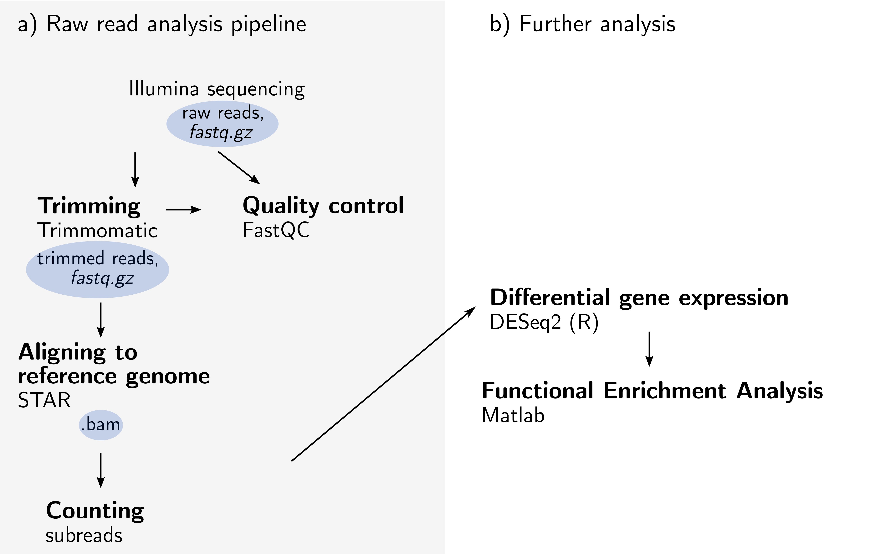

# RNAseq

... What we have to do

-**Preparing a fasta reference**
  - First we need a DNA reference (fasta) of the organism that we are investigating. 
    - we can optionally adjust the fasta to our lab strain (change SNPs, Indels)
    - Create an index with the script: **0_DicIndex.sh**
    - We need a list of features, (genes in this case), for which we count the reads that map to it

- **Rohdaten bearbeiten**
  - **fastq**: Raw data is provided in the .fastq format, where we have paired-end reads (forward _1 & reverse _2), compressed in the .fastq.gz format.  
  - First, run a Quality control und trimmen: **1_ QCScript.sh**
    - [fastqc](https://www.bioinformatics.babraham.ac.uk/projects/fastqc/) benutzen, um die Qualität der Rohdaten zu checken.
    - [trimmomatic](http://www.usadellab.org/cms/?page=trimmomatic) benutzen, um Adapter und zu kurze/ zu schlechte reads zu trimmen.
    - (check die Qualität nochmal - verbessert?)
    - richtige Wahl der Adapter siehe adapter_Consideration.txt und CCG_RNA_IlluminaAdapter.fa 
 

- **Reads mappen**
  - Die getrimmten reads werden mit [Star](https://github.com/alexdobin/STAR) auf die Referenz gemappt
  - mit featurecounts (subread) wird die Anzahl der reads bestimmt, die auf die feature entfallen
  
- **Count quantification/ analysis**
  - Was bedeuten die counts pro feature jetzt? --> das wird in R (matlab?) analysiert 
  
  
- **Other software**
  - **IGV**: http://software.broadinstitute.org/software/igv/

